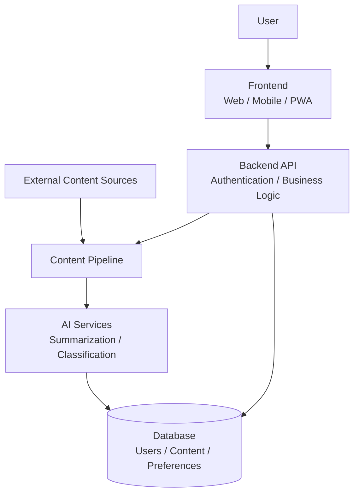
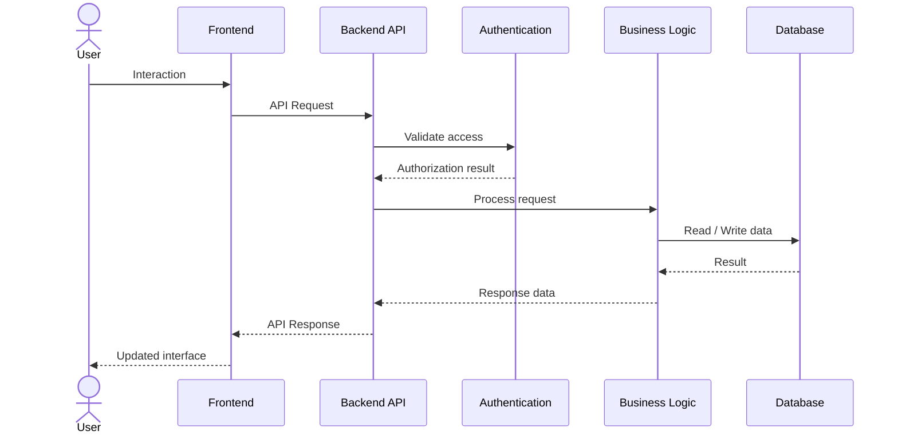
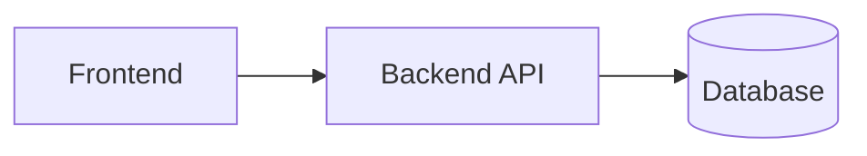
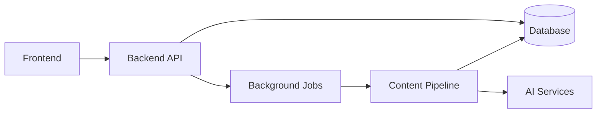
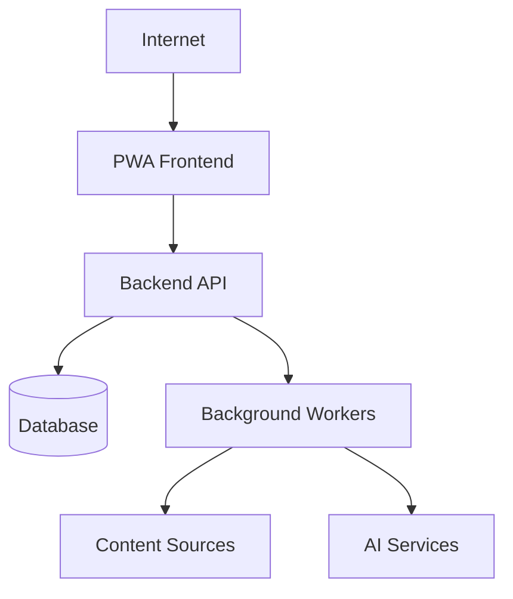
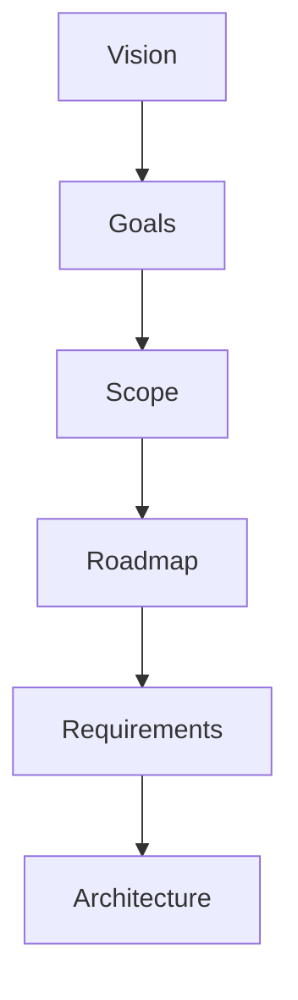
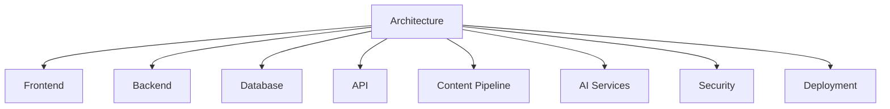

# AI Daily — Architecture

## 1. Overview

This document describes the high-level architecture of AI Daily.

It defines the main components of the system, their responsibilities, and the relationships between them.

The architecture is designed to support the current MVP while allowing AI Daily to evolve toward a more scalable, personalized, and AI-assisted platform.

The architecture should remain modular so that individual components can evolve without requiring a complete redesign of the system.

---

## 2. Architectural Goals

The architecture of AI Daily should support the following goals:

- Provide a clear separation of responsibilities.
- Keep the system modular and maintainable.
- Support the development of the MVP without unnecessary complexity.
- Allow the platform to evolve progressively.
- Support automated content collection and processing.
- Provide a foundation for user accounts and personalization.
- Protect user data and application resources.
- Support future AI-powered features.
- Allow individual services to be improved or replaced independently when appropriate.

---

## 3. High-Level Architecture

AI Daily will follow a layered and modular architecture.

At a high level, the system can be represented as:

This diagram represents the conceptual architecture. The exact technologies and infrastructure will be defined separately.

---

## 4. Main Components

AI Daily is composed of several major components.

### 4.1 Frontend

The frontend is the user-facing part of AI Daily.

Its responsibilities include:

- Rendering the user interface.
- Displaying content.
- Managing navigation.
- Handling user interactions.
- Communicating with the backend API.
- Managing appropriate client-side state.
- Providing the PWA experience.
- Handling responsive layouts.
- Providing accessible interfaces.

The frontend should not contain business logic that belongs to the backend.

---

### 4.2 Backend

The backend provides the core application services.

Its responsibilities include:

- Exposing the API.
- Managing business logic.
- Managing authentication and authorization.
- Validating requests.
- Managing user-related operations.
- Managing content-related operations.
- Communicating with the database.
- Coordinating external services.
- Managing application-level security.

The backend acts as the primary interface between the frontend and the application's data and services.

---

### 4.3 Database

The database stores persistent application data.

Potential data domains include:

- Users.
- User preferences.
- Content.
- Sources.
- Categories.
- Saved content.
- Reading history.
- Notifications.
- Content-processing metadata.

The database design should support data integrity, efficient queries, and future growth.

The exact database technology and schema will be documented separately.

---

### 4.4 Content Pipeline

The content pipeline is responsible for collecting and preparing information for AI Daily.

Its responsibilities include:

- Collecting content from supported sources.
- Extracting relevant information.
- Normalizing data.
- Detecting duplicates.
- Categorizing content.
- Preparing content for storage.
- Tracking source information.
- Triggering AI-assisted processing when required.

The content pipeline should be designed so that new sources can be added without redesigning the entire system.

---

### 4.5 AI Services

AI services provide artificial-intelligence capabilities to the platform.

Potential responsibilities include:

- Summarizing content.
- Classifying content.
- Extracting topics.
- Enriching metadata.
- Detecting similarities.
- Supporting recommendations.
- Assisting content discovery.

AI services should remain modular and should not be tightly coupled to the rest of the application.

This makes it possible to change models or providers without significantly changing the core application.

---

### 4.6 Authentication and Authorization

Authentication determines who a user is.

Authorization determines what that user is allowed to access or modify.

These responsibilities may initially be implemented within the backend but should remain logically separated from other business components.

Authentication and authorization must protect:

- User accounts.
- Private user data.
- Saved content.
- User preferences.
- Administrative operations.

---

### 4.7 External Services

AI Daily may interact with external services.

Potential external dependencies include:

- Content sources.
- AI model providers.
- Email providers.
- Push notification services.
- Authentication services.
- Hosting platforms.
- Monitoring services.

External integrations should be isolated behind clear interfaces whenever practical.

---

## 5. Data Flow

A simplified content flow can be represented as:

```mermaid
flowchart LR
    Sources["External Sources"] --> Collect["Content Collection"]
    Collect --> Normalize["Normalization"]
    Normalize --> Dedup["Duplicate Detection"]
    Dedup --> Classify["Classification"]
    Classify --> AI["AI-Assisted Processing"]
    AI --> Quality["Quality Checks"]
    Quality --> Database[("Database")]
    Database --> API["Backend API"]
    API --> Frontend["Frontend"]
    Frontend --> User["User"]
```

This flow may evolve as the content pipeline becomes more sophisticated.

---

## 6. User Request Flow

A typical user request follows this general flow:

The frontend should communicate with the backend through defined API boundaries rather than accessing the database directly.

---

## 7. Separation of Responsibilities

The system should maintain clear boundaries between components.

### Frontend

Responsible for:

- Presentation.
- User interaction.
- Navigation.
- Client-side state.

### Backend

Responsible for:

- Business rules.
- API operations.
- Authentication.
- Authorization.
- Data access coordination.

### Database

Responsible for:

- Persistent storage.
- Data integrity.
- Data relationships.

### Content Pipeline

Responsible for:

- Collection.
- Processing.
- Normalization.
- Content preparation.

### AI Services

Responsible for:

- AI-powered processing.
- AI-assisted analysis.
- AI-powered recommendations when implemented.

This separation reduces coupling and makes the system easier to test and maintain.

---

## 8. Architecture Evolution

The architecture will evolve with the project.

### MVP

The initial architecture should prioritize simplicity.

A possible initial structure is:

The content pipeline and AI processing may initially operate as backend processes or separate modules.

### Post-MVP

As requirements increase, the architecture may evolve toward:

Additional infrastructure should only be introduced when justified by actual requirements.

---

## 9. Scalability Considerations

The architecture should allow AI Daily to scale progressively.

Potential scaling strategies include:

- Separating background processing from user-facing requests.
- Introducing job queues.
- Caching frequently accessed data.
- Optimizing database queries.
- Using object storage for large assets.
- Scaling backend instances horizontally.
- Separating AI workloads from core application workloads.
- Introducing dedicated services when necessary.

These strategies should be introduced based on measurable needs rather than premature optimization.

---

## 10. Security Architecture

Security should be considered across all architectural layers.

### Frontend

- Avoid exposing sensitive credentials.
- Validate user input where appropriate.
- Use secure communication.

### Backend

- Authenticate requests when required.
- Authorize protected operations.
- Validate incoming data.
- Protect secrets.
- Apply rate limiting where appropriate.
- Handle errors without exposing sensitive information.

### Database

- Restrict access.
- Protect sensitive information.
- Apply appropriate permissions.
- Maintain data integrity.

### External Services

- Store credentials securely.
- Restrict API permissions.
- Monitor external dependencies.
- Handle service failures safely.

---

## 11. Observability

The system should progressively introduce observability mechanisms.

These may include:

- Application logs.
- Error tracking.
- Performance monitoring.
- Health checks.
- Background-job monitoring.
- Infrastructure monitoring.

Observability will become increasingly important as AI Daily moves toward production.

---

## 12. Deployment Architecture

AI Daily should be deployable using a modern web infrastructure.

The deployment architecture may include:

The exact hosting providers, deployment platforms, CI/CD workflows, and infrastructure configuration will be documented separately.

---

## 13. Technology Independence

This document intentionally focuses on architectural responsibilities rather than locking the project to specific technologies.

Technology choices should be documented separately and evaluated according to:

- Project requirements.
- Developer experience.
- Performance.
- Maintainability.
- Community support.
- Cost.
- Scalability.
- Security.
- Long-term viability.

Changing a technology should not require changing the overall architectural principles unless the new technology introduces fundamentally different constraints.

---

## 14. Architectural Decisions

Important architectural decisions should be documented separately.

Each significant decision should explain:

- The problem.
- The context.
- The options considered.
- The selected approach.
- The reasoning behind the decision.
- The consequences.

This will help maintain a clear history of how the architecture evolves.

---

## 15. Relationship with Other Documentation

The architecture is derived from the project's previous documentation:

The architecture then provides the foundation for more detailed technical documentation:

These components may receive dedicated documentation as the project grows.

---

## 16. Current Status

The architecture described in this document represents the current high-level architectural direction of AI Daily.

It is intentionally designed to evolve.

Detailed technology choices, database schemas, API contracts, infrastructure configurations, and implementation details should be documented separately as they are established.