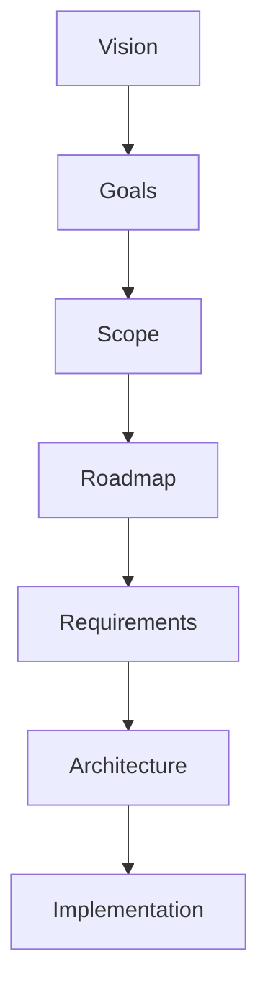

# AI Daily — Exigences

## 1. Vue d'ensemble

Ce document définit les exigences fonctionnelles et non fonctionnelles d'AI Daily.

L'objectif de ces exigences est de décrire ce que le système doit fournir sans définir en détail la manière dont ces fonctionnalités seront implémentées.

Ces exigences serviront de base à l'architecture du système, à la conception de la base de données, à la conception de l'API, à l'interface utilisateur et aux futures décisions de développement.

---

## 2. Principes des exigences

Les exigences d'AI Daily doivent respecter les principes suivants :

- Se concentrer sur les besoins des utilisateurs et les objectifs du projet.
- Garder le système initial simple et compréhensible.
- Donner la priorité à l'expérience principale du MVP.
- Séparer les exigences essentielles des fonctionnalités futures.
- Rester indépendantes des technologies lorsque cela est possible.
- Permettre aux exigences d'évoluer avec le projet.
- Prendre en compte dès le début la sécurité, les performances, l'accessibilité et la maintenabilité.

---

## 3. Exigences utilisateurs

AI Daily doit permettre aux utilisateurs de :

- Découvrir des informations liées à l'intelligence artificielle.
- Lire des articles et autres contenus pris en charge.
- Rechercher des sujets spécifiques liés à l'IA.
- Parcourir les contenus par catégories ou thématiques.
- Accéder à des informations provenant de différentes sources.
- Comprendre les points principaux d'un article grâce à des résumés concis lorsqu'ils sont disponibles.
- Sauvegarder des contenus pour les consulter ultérieurement.
- Créer un compte pour accéder aux fonctionnalités personnalisées.
- Gérer leurs préférences.
- Recevoir des contenus pertinents en fonction de leurs centres d'intérêt.
- Accéder à la plateforme depuis différents appareils.

Certaines de ces fonctionnalités seront introduites progressivement et ne seront donc pas nécessairement disponibles dans la première version.

---

## 4. Exigences fonctionnelles

### 4.1 Découverte des contenus

Le système doit fournir une interface centrale permettant aux utilisateurs de découvrir des contenus liés à l'IA.

Le système doit notamment :

- Afficher des contenus récents et pertinents.
- Organiser les contenus par catégories ou thématiques.
- Fournir les métadonnées principales de chaque contenu.
- Indiquer la source originale.
- Donner accès au contenu complet ou à la source originale lorsque cela est approprié.

---

### 4.2 Pages de contenu

Le système doit fournir une page dédiée pour chaque contenu pris en charge.

Une page de contenu doit fournir :

- Le titre.
- Le résumé lorsqu'il est disponible.
- La date de publication.
- La source.
- La catégorie ou thématique associée.
- Un lien vers la source originale.
- Les autres métadonnées pertinentes.

---

### 4.3 Recherche

Le système doit fournir un mécanisme permettant aux utilisateurs de rechercher des contenus.

La recherche doit progressivement pouvoir prendre en charge :

- Les mots-clés.
- Les thématiques.
- Les catégories.
- Les métadonnées pertinentes.
- Une recherche sémantique plus avancée dans une phase ultérieure.

L'implémentation initiale doit rester simple et se concentrer sur une recherche basique fiable.

---

### 4.4 Catégories et thématiques

AI Daily doit organiser les contenus à l'aide de catégories ou de thématiques.

Les domaines possibles comprennent notamment :

- Intelligence artificielle.
- Machine Learning.
- Deep Learning.
- IA générative.
- Large Language Models.
- Computer Vision.
- Robotique.
- Recherche en IA.
- Outils d'IA.
- Industrie de l'IA.
- Applications de l'IA.

La taxonomie exacte pourra évoluer au fur et à mesure du développement de la plateforme.

---

### 4.5 Comptes utilisateurs

Le système doit progressivement prendre en charge les comptes utilisateurs pour les fonctionnalités nécessitant une personnalisation.

Les utilisateurs doivent pouvoir :

- Créer un compte.
- S'authentifier de manière sécurisée.
- Gérer leur profil.
- Gérer leurs préférences.
- Sauvegarder des contenus.
- Consulter leur historique de lecture.
- Gérer leurs préférences de notification.

Un compte utilisateur n'est pas nécessaire pour l'expérience de base de découverte des contenus du MVP, sauf lorsqu'une fonctionnalité particulière nécessite une authentification.

---

### 4.6 Personnalisation

AI Daily doit progressivement proposer des expériences de contenu personnalisées.

La personnalisation peut utiliser :

- Les thématiques sélectionnées.
- Les contenus sauvegardés.
- L'historique de lecture.
- Les préférences de l'utilisateur.
- D'autres données d'interaction pertinentes.

La personnalisation doit être introduite progressivement et ne doit pas compliquer inutilement la première version du système.

---

### 4.7 Collecte des contenus

Le système doit prendre en charge la collecte d'informations liées à l'IA provenant de sources externes.

Le pipeline de contenu doit progressivement pouvoir :

- Collecter des informations provenant de sources prises en charge.
- Traiter les contenus collectés.
- Extraire les métadonnées.
- Détecter les doublons.
- Catégoriser les contenus.
- Préparer les contenus pour leur publication.
- Conserver la trace de la source originale.

Les mécanismes précis de collecte seront définis dans l'architecture technique.

---

### 4.8 Traitement assisté par l'IA

AI Daily peut utiliser l'intelligence artificielle pour assister le traitement des contenus.

Les fonctionnalités potentielles comprennent :

- La génération de résumés.
- La classification.
- L'extraction de thématiques.
- L'enrichissement des métadonnées.
- La détection de similarité entre contenus.
- La génération de recommandations.

Le traitement assisté par l'IA doit soutenir la plateforme sans remplacer l'attribution des sources ni la traçabilité des contenus.

---

### 4.9 Contenus sauvegardés

Les utilisateurs authentifiés doivent pouvoir sauvegarder des contenus pour les consulter ultérieurement.

Le système doit :

- Permettre de sauvegarder un contenu.
- Permettre de supprimer un contenu sauvegardé.
- Donner accès aux contenus sauvegardés.
- Associer les contenus sauvegardés au compte utilisateur correspondant.

---

### 4.10 Notifications

AI Daily doit progressivement prendre en charge les notifications concernant les nouveaux contenus pertinents.

Les utilisateurs doivent pouvoir :

- Activer ou désactiver les notifications.
- Configurer leurs préférences de notification.
- Recevoir des mises à jour pertinentes.

Les notifications sont considérées comme une fonctionnalité post-MVP.

---

### 4.11 Progressive Web App

AI Daily doit être conçu comme une Progressive Web Application.

Le système doit progressivement prendre en charge :

- L'installation sur les appareils compatibles.
- Un comportement responsive.
- Un chargement fiable.
- Des fonctionnalités hors ligne appropriées.
- Les notifications push lorsqu'elles seront implémentées.

---

## 5. Exigences non fonctionnelles

### 5.1 Performance

L'application doit fournir une expérience utilisateur réactive.

Le système doit :

- Réduire les temps de chargement inutiles.
- Optimiser les ressources et les requêtes réseau.
- Éviter les traitements inutiles côté client.
- Gérer efficacement l'augmentation du volume de contenu.

Les performances doivent être surveillées et améliorées tout au long du développement.

---

### 5.2 Sécurité

Le système doit protéger les données des utilisateurs et les ressources de l'application.

Les exigences de sécurité comprennent :

- Une authentification sécurisée.
- Une gestion sécurisée des mots de passe lorsqu'ils sont utilisés.
- Des mécanismes d'autorisation appropriés.
- La protection des données sensibles des utilisateurs.
- Des communications sécurisées.
- La validation des entrées.
- La protection contre les vulnérabilités web courantes.
- La gestion sécurisée des services externes et des identifiants d'API.

---

### 5.3 Confidentialité

AI Daily doit respecter la confidentialité des utilisateurs.

Le système doit :

- Collecter uniquement les informations nécessaires à son fonctionnement.
- Définir clairement la manière dont les données des utilisateurs sont utilisées.
- Éviter la collecte inutile d'informations personnelles.
- Fournir des contrôles appropriés sur les données des utilisateurs.
- Prendre en compte les exigences applicables en matière de confidentialité et de protection des données.

---

### 5.4 Accessibilité

L'interface doit être accessible au plus grand nombre d'utilisateurs possible dans la mesure du raisonnable.

Le système doit prendre en compte :

- La navigation au clavier.
- L'utilisation d'un HTML sémantique.
- Un contraste approprié.
- Une typographie lisible.
- Des textes alternatifs pour les images pertinentes.
- Des composants interactifs accessibles.
- La compatibilité avec les lecteurs d'écran.

L'accessibilité doit être prise en compte dès la conception et l'implémentation plutôt qu'ajoutée à la fin.

---

### 5.5 Responsive design

L'application doit fonctionner sur différentes tailles d'écran.

L'interface doit fournir une expérience cohérente sur :

- Les appareils mobiles.
- Les tablettes.
- Les ordinateurs portables.
- Les ordinateurs de bureau.

---

### 5.6 Maintenabilité

Le code source doit rester compréhensible et maintenable à mesure que le projet évolue.

Le projet doit :

- Utiliser des conventions de nommage claires.
- Respecter des standards de code cohérents.
- Séparer correctement les responsabilités.
- Documenter les décisions techniques importantes.
- Éviter les couplages inutiles.
- Utiliser efficacement le contrôle de version.
- Maintenir des tests automatisés pertinents à mesure que le projet mûrit.

---

### 5.7 Évolutivité

AI Daily doit être conçu de manière à pouvoir évoluer sans nécessiter une refonte complète du système.

Les éléments à prendre en compte comprennent :

- L'augmentation du nombre d'utilisateurs.
- L'augmentation du volume de contenu.
- L'augmentation des recherches.
- L'augmentation des traitements en arrière-plan.
- L'ajout de nouvelles sources de contenu externes.
- Les futures fonctionnalités utilisant l'IA.

L'évolutivité doit être traitée proportionnellement aux besoins réels du projet plutôt que d'introduire une infrastructure inutilement complexe durant le MVP.

---

### 5.8 Fiabilité

Le système doit rester disponible et prévisible dans des conditions normales d'utilisation.

Le projet doit progressivement mettre en place :

- La gestion des erreurs.
- Les logs.
- Le monitoring.
- La détection des défaillances.
- Les mécanismes de récupération.
- Les stratégies de sauvegarde lorsque cela est nécessaire.

---

## 6. Exigences du MVP

Le MVP doit se concentrer sur l'ensemble minimal de fonctionnalités nécessaires pour valider le concept principal d'AI Daily.

### Requis pour le MVP

- Interface web responsive.
- Page d'accueil.
- Flux de contenus liés à l'IA.
- Cartes de contenu.
- Pages détaillées des contenus.
- Catégories ou thématiques.
- Recherche basique.
- Attribution des sources.
- Fonctionnalités PWA de base.
- Collecte et organisation basiques des contenus.

### Non requis pour le MVP

Les fonctionnalités suivantes pourront être développées ultérieurement :

- Comptes utilisateurs.
- Personnalisation avancée.
- Historique de lecture.
- Recommandations avancées.
- Notifications push.
- Recherche sémantique.
- Traitement avancé par IA.
- Fonctionnalités communautaires.
- Analyses avancées.

Cette séparation permet au projet de valider sa proposition de valeur principale avant d'introduire davantage de complexité.

---

## 7. Exigences futures

À mesure qu'AI Daily évoluera, de nouvelles exigences pourront être introduites.

Les évolutions possibles comprennent :

- Des systèmes de recommandation avancés.
- Des digests quotidiens personnalisés.
- Plusieurs canaux de notification.
- Une recherche sémantique et en langage naturel.
- De nouvelles langues.
- Des interactions communautaires.
- Des analyses avancées.
- Des outils pour les contributeurs.
- Des intégrations avec des plateformes externes.
- Des fonctionnalités avancées de découverte assistées par l'IA.

Les futures exigences doivent être évaluées en fonction de la vision, des objectifs, du périmètre, des contraintes techniques et des besoins des utilisateurs.

---

## 8. Priorisation des exigences

Les exigences doivent être priorisées en fonction de leur importance.

Le projet utilisera trois grands niveaux de priorité :

### Must Have

Fonctionnalités nécessaires au fonctionnement principal d'une phase de développement donnée.

### Should Have

Fonctionnalités importantes qui améliorent le produit mais qui ne sont pas essentielles à la première version de cette phase.

### Could Have

Fonctionnalités utiles pouvant être implémentées lorsque les ressources et les priorités le permettent.

Cette priorisation peut évoluer au fur et à mesure du développement du projet.

---

## 9. Évolution des exigences

Les exigences sont susceptibles d'évoluer tout au long du développement d'AI Daily.

Des changements peuvent apparaître en raison :

- Des retours des utilisateurs.
- Des découvertes techniques.
- De nouveaux cas d'utilisation.
- De considérations liées à la sécurité.
- Des exigences de performance.
- Des évolutions de l'écosystème de l'IA.
- Des changements dans les priorités du projet.

Les changements importants doivent être documentés lorsqu'ils affectent le périmètre, l'architecture ou la direction du développement.

---

## 10. Relation avec les autres documents

Ce document fournit une base fonctionnelle pour la documentation technique qui suivra.

La relation attendue est :

Les exigences définies ici doivent guider l'architecture et l'implémentation tout en restant indépendantes des technologies spécifiques lorsque cela est possible.

---

## 11. État actuel

Ce document représente la compréhension actuelle de ce qu'AI Daily doit fournir.

Il doit être révisé et mis à jour au fur et à mesure que le projet passe de la phase de planification à l'implémentation et que de nouvelles informations deviennent disponibles.
