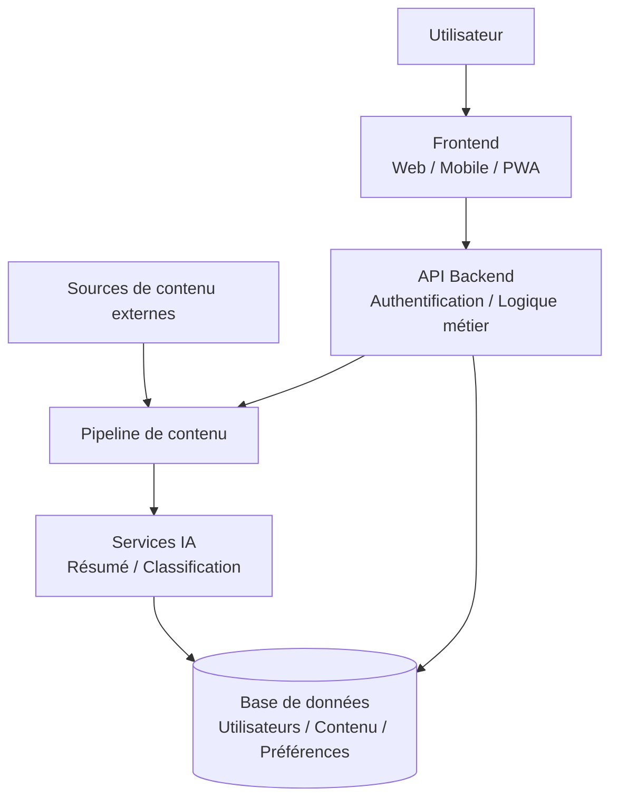
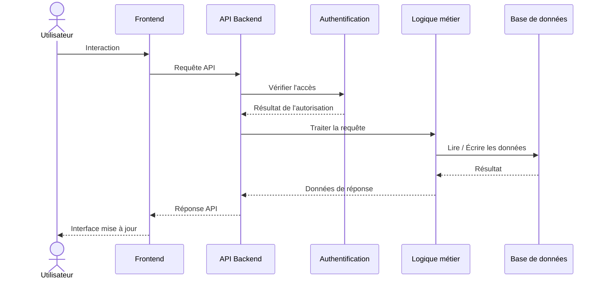
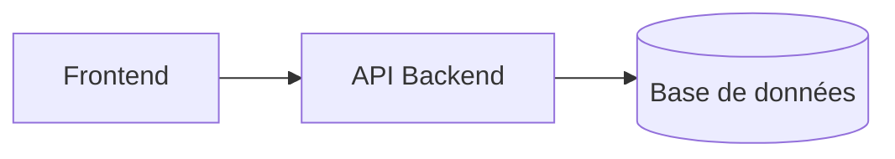
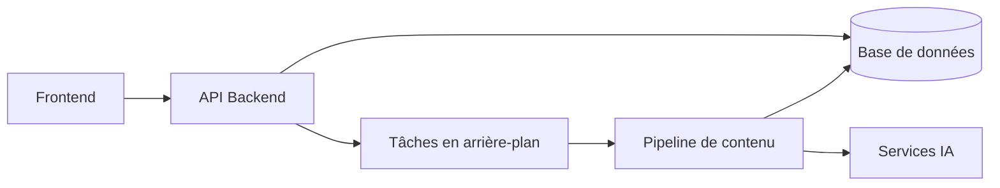
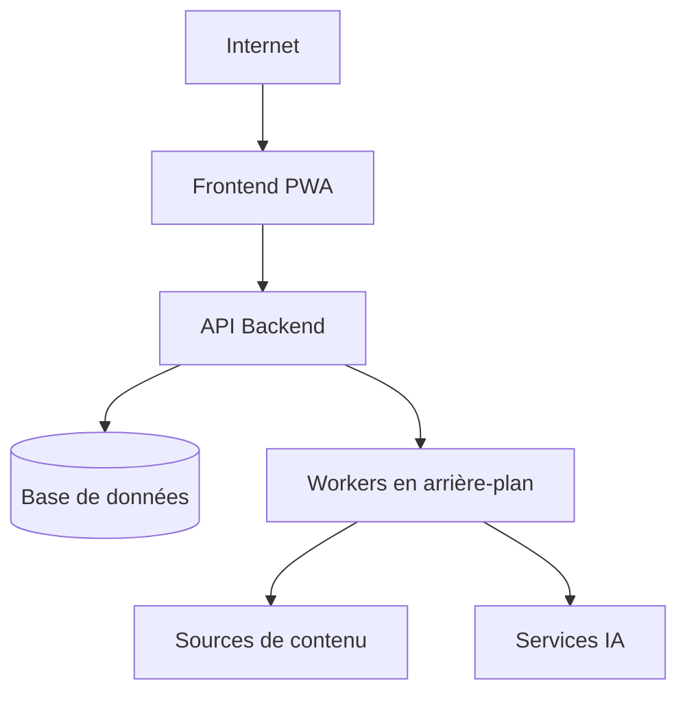
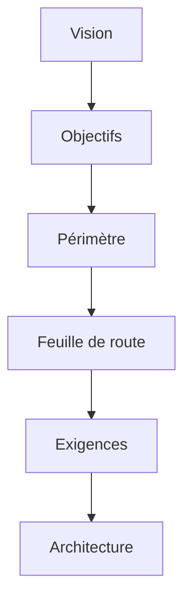
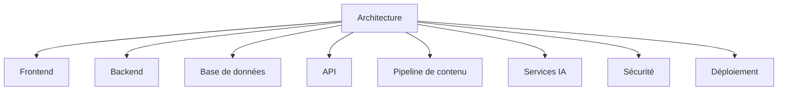

# AI Daily — Architecture

## 1. Vue d'ensemble

Ce document décrit l'architecture générale d'AI Daily.

Il définit les principaux composants du système, leurs responsabilités et leurs relations.

L'architecture est conçue pour prendre en charge le MVP actuel tout en permettant à AI Daily d'évoluer vers une plateforme plus évolutive, personnalisée et assistée par l'IA.

L'architecture doit rester modulaire afin que les différents composants puissent évoluer sans nécessiter une refonte complète du système.

---

## 2. Objectifs architecturaux

L'architecture d'AI Daily doit répondre aux objectifs suivants :

- Assurer une séparation claire des responsabilités.
- Maintenir un système modulaire et facile à maintenir.
- Permettre le développement du MVP sans complexité inutile.
- Permettre une évolution progressive de la plateforme.
- Prendre en charge la collecte et le traitement automatisés du contenu.
- Fournir une base pour les comptes utilisateurs et la personnalisation.
- Protéger les données des utilisateurs et les ressources de l'application.
- Préparer l'intégration future de fonctionnalités basées sur l'IA.
- Permettre d'améliorer ou de remplacer certains services indépendamment lorsque cela est pertinent.

---

## 3. Architecture générale

AI Daily adoptera une architecture modulaire et organisée en couches.

À haut niveau, le système peut être représenté comme suit :

Ce diagramme représente l'architecture conceptuelle. Les technologies et l'infrastructure exactes seront définies séparément.

---

## 4. Principaux composants

AI Daily est composé de plusieurs composants majeurs.

### 4.1 Frontend

Le frontend constitue la partie d'AI Daily directement utilisée par les utilisateurs.

Ses responsabilités comprennent :

- Afficher l'interface utilisateur.
- Afficher le contenu.
- Gérer la navigation.
- Gérer les interactions utilisateur.
- Communiquer avec l'API backend.
- Gérer l'état côté client lorsque cela est nécessaire.
- Fournir l'expérience PWA.
- Gérer les interfaces responsives.
- Fournir des interfaces accessibles.

Le frontend ne doit pas contenir de logique métier qui relève du backend.

---

### 4.2 Backend

Le backend fournit les services principaux de l'application.

Ses responsabilités comprennent :

- Exposer l'API.
- Gérer la logique métier.
- Gérer l'authentification et l'autorisation.
- Valider les requêtes.
- Gérer les opérations liées aux utilisateurs.
- Gérer les opérations liées au contenu.
- Communiquer avec la base de données.
- Coordonner les services externes.
- Gérer la sécurité au niveau de l'application.

Le backend constitue l'interface principale entre le frontend et les données et services de l'application.

---

### 4.3 Base de données

La base de données stocke les données persistantes de l'application.

Les principaux domaines de données peuvent inclure :

- Les utilisateurs.
- Les préférences utilisateur.
- Le contenu.
- Les sources.
- Les catégories.
- Le contenu sauvegardé.
- L'historique de lecture.
- Les notifications.
- Les métadonnées liées au traitement du contenu.

La conception de la base de données doit garantir l'intégrité des données, l'efficacité des requêtes et la possibilité d'une évolution future.

La technologie de base de données et le schéma exact seront documentés séparément.

---

### 4.4 Pipeline de contenu

Le pipeline de contenu est responsable de la collecte et de la préparation des informations pour AI Daily.

Ses responsabilités comprennent :

- Collecter le contenu provenant des sources prises en charge.
- Extraire les informations pertinentes.
- Normaliser les données.
- Détecter les doublons.
- Catégoriser le contenu.
- Préparer le contenu pour son stockage.
- Conserver les informations relatives aux sources.
- Déclencher le traitement assisté par l'IA lorsque cela est nécessaire.

Le pipeline de contenu doit être conçu de manière à permettre l'ajout de nouvelles sources sans nécessiter une refonte complète du système.

---

### 4.5 Services IA

Les services IA fournissent les capacités d'intelligence artificielle de la plateforme.

Leurs responsabilités potentielles comprennent :

- Résumer le contenu.
- Classifier le contenu.
- Extraire les sujets.
- Enrichir les métadonnées.
- Détecter les similarités.
- Prendre en charge les recommandations.
- Faciliter la découverte de contenu.

Les services IA doivent rester modulaires et ne pas être fortement couplés au reste de l'application.

Cela permet de changer de modèles ou de fournisseurs sans modifier de manière importante le cœur de l'application.

---

### 4.6 Authentification et autorisation

L'authentification permet de déterminer l'identité d'un utilisateur.

L'autorisation permet de déterminer ce que cet utilisateur est autorisé à consulter ou à modifier.

Ces responsabilités peuvent initialement être implémentées au sein du backend, mais doivent rester logiquement séparées des autres composants métier.

L'authentification et l'autorisation doivent protéger :

- Les comptes utilisateurs.
- Les données privées des utilisateurs.
- Le contenu sauvegardé.
- Les préférences utilisateur.
- Les opérations administratives.

---

### 4.7 Services externes

AI Daily pourra interagir avec différents services externes.

Les dépendances externes potentielles comprennent :

- Les sources de contenu.
- Les fournisseurs de modèles IA.
- Les fournisseurs de services d'e-mail.
- Les services de notifications push.
- Les services d'authentification.
- Les plateformes d'hébergement.
- Les services de monitoring.

Lorsque cela est pertinent, les intégrations externes doivent être isolées derrière des interfaces clairement définies.

---

## 5. Flux de données

Un flux simplifié du contenu peut être représenté comme suit :

```mermaid
flowchart LR
    Sources["Sources externes"] --> Collect["Collecte du contenu"]
    Collect --> Normalize["Normalisation"]
    Normalize --> Dedup["Détection des doublons"]
    Dedup --> Classify["Classification"]
    Classify --> AI["Traitement assisté par l'IA"]
    AI --> Quality["Contrôles qualité"]
    Quality --> Database[("Base de données")]
    Database --> API["API Backend"]
    API --> Frontend["Frontend"]
    Frontend --> User["Utilisateur"]
```

Ce flux pourra évoluer au fur et à mesure que le pipeline de contenu deviendra plus sophistiqué.

---

## 6. Flux d'une requête utilisateur

Une requête utilisateur typique suit le flux général suivant :

Le frontend doit communiquer avec le backend à travers des limites d'API définies plutôt que d'accéder directement à la base de données.

---

## 7. Séparation des responsabilités

Le système doit maintenir des limites claires entre les différents composants.

### Frontend

Responsable de :

- La présentation.
- Les interactions utilisateur.
- La navigation.
- L'état côté client.

### Backend

Responsable de :

- Les règles métier.
- Les opérations de l'API.
- L'authentification.
- L'autorisation.
- La coordination de l'accès aux données.

### Base de données

Responsable de :

- Le stockage persistant.
- L'intégrité des données.
- Les relations entre les données.

### Pipeline de contenu

Responsable de :

- La collecte.
- Le traitement.
- La normalisation.
- La préparation du contenu.

### Services IA

Responsables de :

- Le traitement basé sur l'IA.
- L'analyse assistée par l'IA.
- Les recommandations basées sur l'IA lorsqu'elles seront implémentées.

Cette séparation réduit le couplage et rend le système plus facile à tester et à maintenir.

---

## 8. Évolution de l'architecture

L'architecture évoluera avec le projet.

### MVP

L'architecture initiale doit privilégier la simplicité.

Une structure initiale possible est :

Le pipeline de contenu et le traitement IA peuvent initialement fonctionner comme des processus backend ou comme des modules séparés.

### Après le MVP

Lorsque les exigences augmenteront, l'architecture pourra évoluer vers :

Une infrastructure supplémentaire ne doit être introduite que lorsqu'elle est justifiée par des besoins réels.

---

## 9. Considérations liées à la scalabilité

L'architecture doit permettre à AI Daily d'évoluer progressivement.

Les stratégies potentielles comprennent :

- Séparer le traitement en arrière-plan des requêtes destinées aux utilisateurs.
- Introduire des files de tâches.
- Mettre en cache les données fréquemment consultées.
- Optimiser les requêtes de base de données.
- Utiliser un stockage d'objets pour les ressources volumineuses.
- Mettre à l'échelle horizontalement les instances backend.
- Séparer les charges de travail IA des charges de travail principales de l'application.
- Introduire des services dédiés lorsque cela devient nécessaire.

Ces stratégies doivent être introduites en fonction de besoins mesurables plutôt que par optimisation prématurée.

---

## 10. Architecture de sécurité

La sécurité doit être prise en compte à travers toutes les couches de l'architecture.

### Frontend

- Éviter d'exposer des identifiants sensibles.
- Valider les entrées utilisateur lorsque cela est nécessaire.
- Utiliser des communications sécurisées.

### Backend

- Authentifier les requêtes lorsque cela est nécessaire.
- Autoriser les opérations protégées.
- Valider les données entrantes.
- Protéger les secrets.
- Mettre en place une limitation du nombre de requêtes lorsque cela est nécessaire.
- Gérer les erreurs sans exposer d'informations sensibles.

### Base de données

- Restreindre les accès.
- Protéger les informations sensibles.
- Appliquer des permissions appropriées.
- Maintenir l'intégrité des données.

### Services externes

- Stocker les identifiants de manière sécurisée.
- Restreindre les permissions des API.
- Surveiller les dépendances externes.
- Gérer les défaillances des services de manière sûre.

---

## 11. Observabilité

Le système doit progressivement mettre en place des mécanismes d'observabilité.

Cela peut notamment inclure :

- Les journaux de l'application.
- Le suivi des erreurs.
- Le monitoring des performances.
- Les vérifications d'état.
- Le monitoring des tâches en arrière-plan.
- Le monitoring de l'infrastructure.

L'observabilité deviendra de plus en plus importante à mesure qu'AI Daily évoluera vers un environnement de production.

---

## 12. Architecture de déploiement

AI Daily doit pouvoir être déployé à l'aide d'une infrastructure web moderne.

L'architecture de déploiement peut inclure :

Les fournisseurs d'hébergement, les plateformes de déploiement, les workflows CI/CD et la configuration de l'infrastructure seront documentés séparément.

---

## 13. Indépendance vis-à-vis des technologies

Ce document se concentre volontairement sur les responsabilités architecturales plutôt que de verrouiller le projet sur des technologies spécifiques.

Les choix technologiques doivent être documentés séparément et évalués selon :

- Les besoins du projet.
- L'expérience des développeurs.
- Les performances.
- La maintenabilité.
- Le support de la communauté.
- Le coût.
- La scalabilité.
- La sécurité.
- La viabilité à long terme.

Le changement d'une technologie ne devrait pas nécessiter de modifier les principes architecturaux généraux, sauf si la nouvelle technologie introduit des contraintes fondamentalement différentes.

---

## 14. Décisions architecturales

Les décisions architecturales importantes doivent être documentées séparément.

Chaque décision significative doit expliquer :

- Le problème.
- Le contexte.
- Les options envisagées.
- L'approche retenue.
- Les raisons de cette décision.
- Les conséquences.

Cela permettra de conserver un historique clair de l'évolution de l'architecture.

---

## 15. Relation avec les autres documentations

L'architecture découle des documentations précédentes du projet :

L'architecture fournit ensuite la base pour des documentations techniques plus détaillées :

Ces composants pourront recevoir leur propre documentation au fur et à mesure de la croissance du projet.

---

## 16. État actuel

L'architecture décrite dans ce document représente l'orientation architecturale générale actuelle d'AI Daily.

Elle est volontairement conçue pour évoluer.

Les choix technologiques détaillés, les schémas de base de données, les contrats d'API, les configurations d'infrastructure et les détails d'implémentation doivent être documentés séparément au fur et à mesure qu'ils sont établis.
